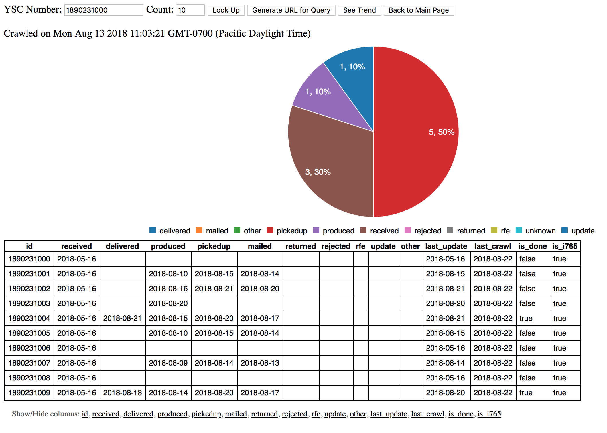
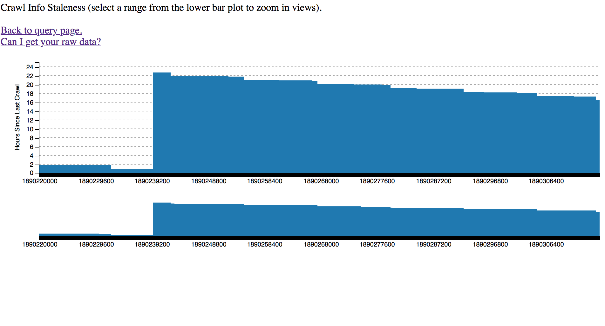
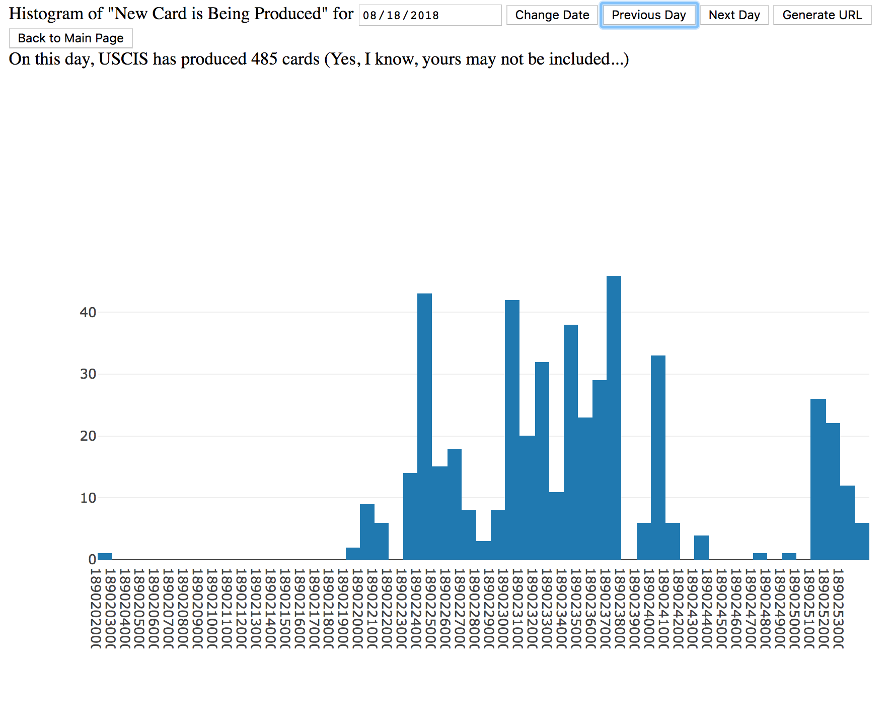
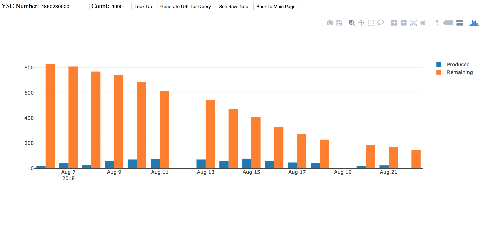

USCIS OPT Crawler, Analyzer, and Visualizer
---

[Live Webpages](http://uscis-opt.s3-website-us-west-1.amazonaws.com/vis/)

### Tech Stack:

- [Crawler in NodeJS](crawler/index.js)
- [Scheduler in Rust](src/main.rs)
- [Backend/Storage with AWS](Makefile)
- [Visualization](frontend)

### Deployment:

- Crawler on Heroku (dynamic IP)
- Scheduler on a low-end box

### Gallery:

USCIS OPT Progress: Crawler and Tracker

<a href="http://uscis-opt.s3-website-us-west-1.amazonaws.com/vis/query.html">

What is the current status for a range?

</a>

<a href="http://uscis-opt.s3-website-us-west-1.amazonaws.com/vis/freshness.html">

How fresh is this result?

</a>
 
<a href="http://uscis-opt.s3-website-us-west-1.amazonaws.com/vis/per-day.html">

How many cases has USCIS approved today?

</a>

<a href="http://uscis-opt.s3-website-us-west-1.amazonaws.com/vis/trend.html">

I want to track a particular range!

</a>

<a href="http://uscis-opt.s3-website-us-west-1.amazonaws.com/raw-data/raw.html">
Can I get your raw data? Yes!
</a>
